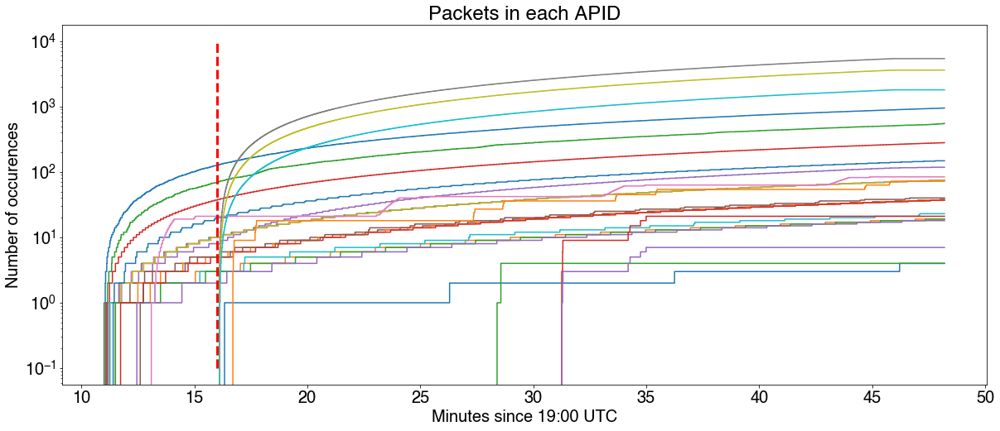
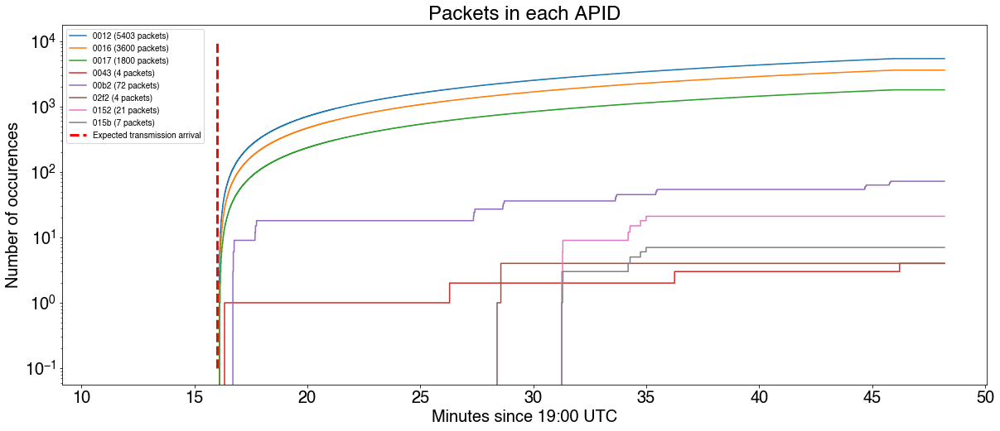

# Absolute packet timing
Once we managed to dump all the SPP packets and classify them by APID, we realized we had no idea where the message could be. We knew nonetheless two things:

* The message was expected to arrive at 19:16 UTC 
* The message took approximately 30 minutes to be transmitted

We therefore looked for a way to classify packets by time of occurrence and extract those that showed up for the first time in the time window of the message. This was easier said than done, as we did not find any time stamps in the headers and the exact location of each packet in the original bitstream is lost in the de-encapsulation process. We came up with the following solution:

1. Write [frames2stamped_packets.c](tools/frames2stamped_packets.c) to extract SPP packets directly from the decoded TM data link frames and prefix them with an `offset` field, indicating the offset inside `frames.bin` in which each packet was found.
2. Write [sppextract-samplecount.c](tools/sppextract-samplecount.c) to convert the prefixed frames into a CSV file (named `statistics.csv`)
3. Use [the following Jupyter Lab document](tools/TimingAnalysis.ipynb) to produce occurrence plots of the packets per APID.

The occurrence plot for all packets of all APIDs was the following:

We definitely see something occurring at the expected arrival time! (red line). If we filter out the packets that show up before the expected arrival time, we have a much cleaner plot:

From which it is clear that APIDs 0012, 0016 and 0017 are our best candidate APIDs so far.
