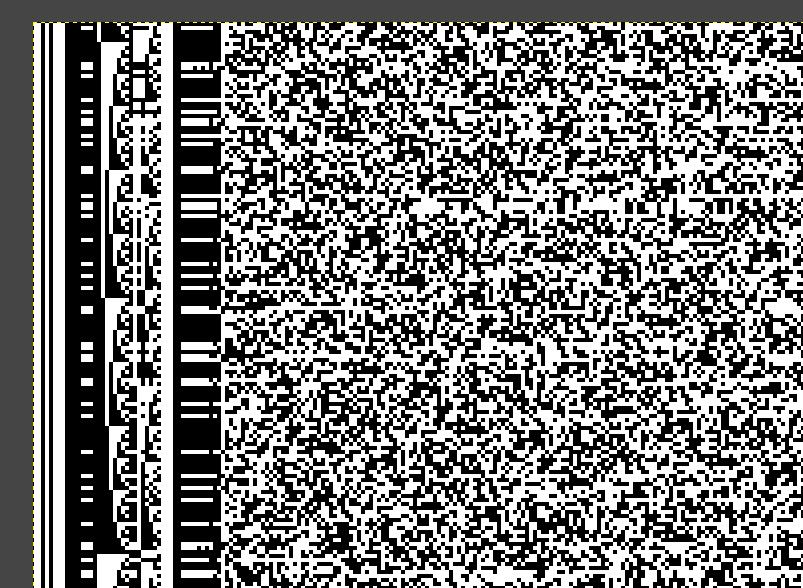

# Link layer (TM)
## From symbols to bits
The demodulated soft symbols of the BPSK subcarrier were passed to [ccsds-tool](https://github.com/BatchDrake/ccsds-tc/tree/791a6638092445816147c99b3406b56f36827e86) in guess mode, with a sync SNR of 15 dB (this is a tool-specific value used to define a threshold for detection of ASM sequences). The tool reported a CCSDS turbocode at rate 1/2 in the Q channel, with a frame length of 8920 bits:

```
$ ccsds-tool -g channel-capture-PM-52639-baud-0001.raw -S 15 
Looking for syncwords for r = 1/2
Looking for syncwords for r = 1/3
Looking for syncwords for r = 1/4
Looking for syncwords for r = 1/6
Candidate CCSDS turbocode found
    Code rate:    1/2
    Channel Q:    6590 frames
    Frame length: 8920 bits
```

After calling `ccsds-tool` again with the 1/2 code-rate, we managed to obtain a [frames.bin](artifacts/frames.bin) file, containing all the successfully decoded turbo-code blocks. The validity of the decodification is verified against the block's CRC.

```
$  ccsds-tool -r 1/2 -f channel-capture-PM-52639-baud-0001.raw -S 15 > frames.bin
CCSDS tool v0.1 for the Amateur DSN by EA1IYR
(c) 2021 Gonzalo J. Carracedo - https://actinid.org
  Code rate:       1/2
  Block length:    8920 bits
  Turbocode iters: 1
  Channel:         Q
  Sync SNR:        15 dB
  Input file: channel-capture-PM-52639-baud-0001.raw
  Output file: stdout
Decode rate: 1.61 Mbpsps
ccsds-tool: 7348965 bytes decoded
```

## Data link format
We know now that the frames are 8920 in length. We then used the [chopper](tools/chopper.c) tool to take the bits from `frames.bin` and produce a bitmap image with 8920 columns, so that similar bits in the same position in each decoded turbo block shows up in the same place, forming patterns:

```
$ gcc chopper.c -o chopper                                    
$ ./chopper frames.bin > image.pbm
Total: 6591 blocks
```

The resulting image looked like follows:



Further analysis on the repeating patterns showed that they were actually [CCSDS TM Data Link frames](doc/132x0b3.pdf) with a 6-byte primary header, no secondary header, 6-byte trailer with a CRC. Two virtual channel IDs were in use along this capture: Virtual Channel 0 (containing encapsulated data of the upper layer) and Virtual Channel 7 (idle data produced from a featureless PRNG noise, [with a polynomial that is not what the specification recommends](analysis/prng.md)).
