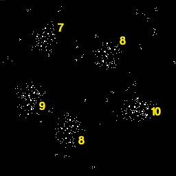
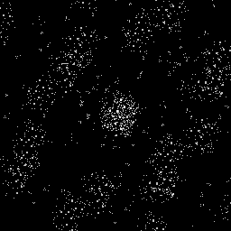
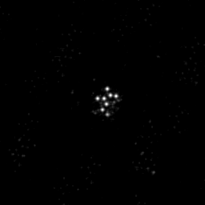

# BatchDrake's analysis
The clusters of points have a varying number of 2x2 pixel blocks, between 7 and 10:

In all clusters, 6 of these 2x2 pixel blocks **form a pattern that is shared by all clusters, with the exact same orientation**. If we overlay all of them, we arrive to the following picture:

If we exaggerate the contrast by the number of overlapping white pixels in the same place, we can distinguish the pattern with more clarity:

