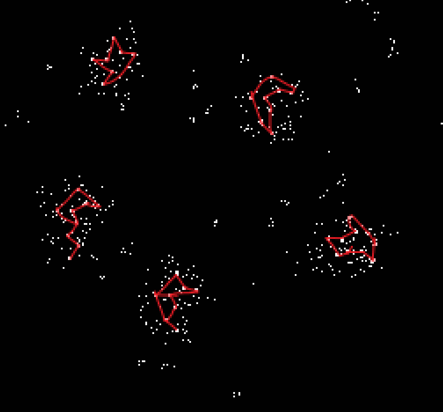
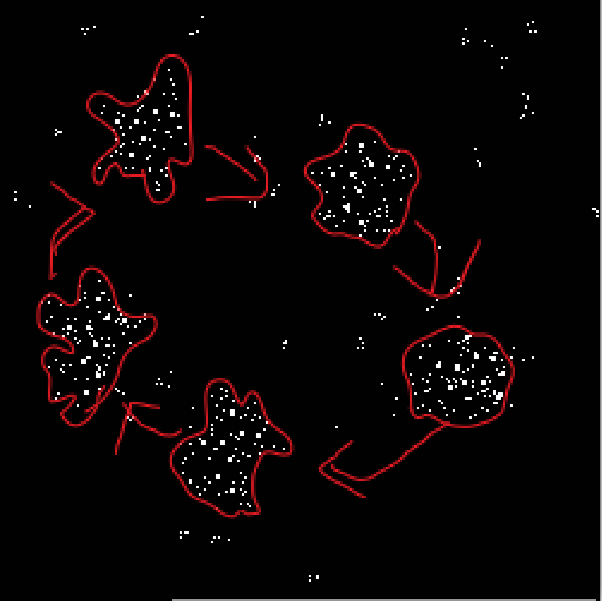
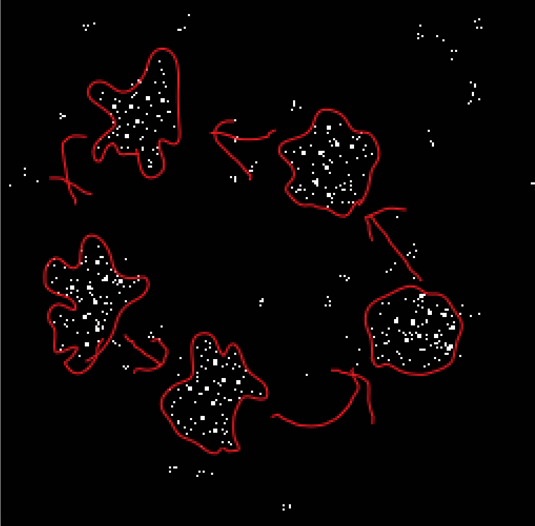
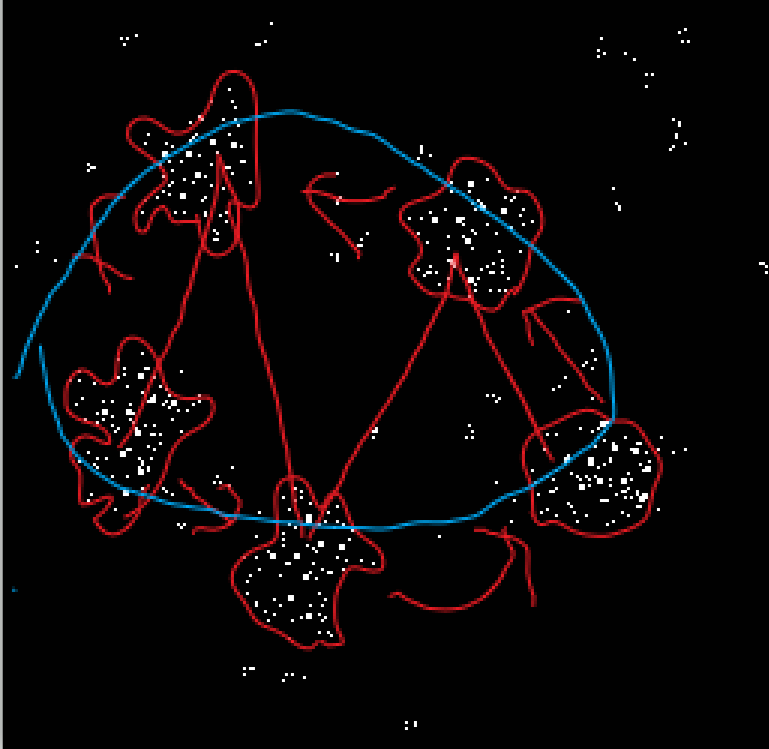

# monarchofshadow's interpretation

The original image:

Formed a unique pattern in each cluster forming symbol by joining square particles and the cluster is a bit similar to the symbol:

The first transformation rotation but when we reverse it present a useful image:

This one is a bit like an organism similar to amoeba which is more similar to taking the external particles in and again pushing out vice-versa:

And finally when we put it in a proper order we get a letter M which we don’t know what it means still trying to interpret:

