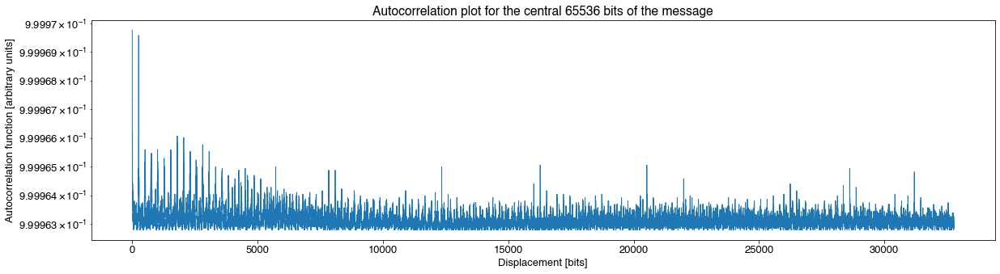
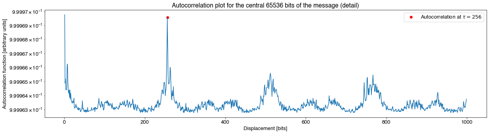
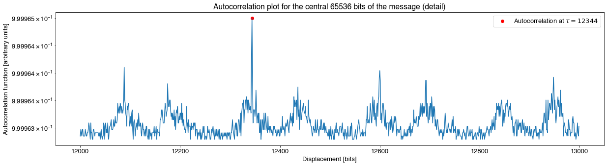
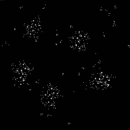
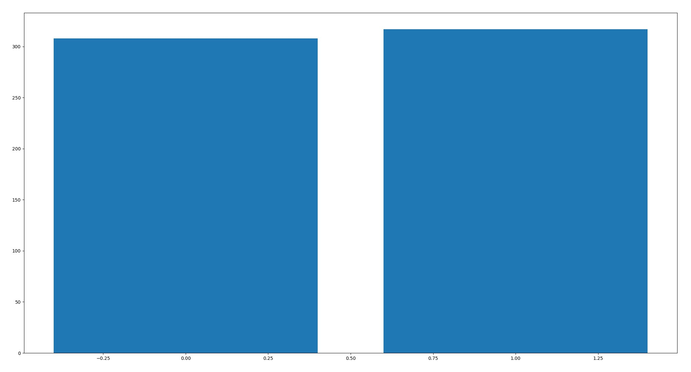
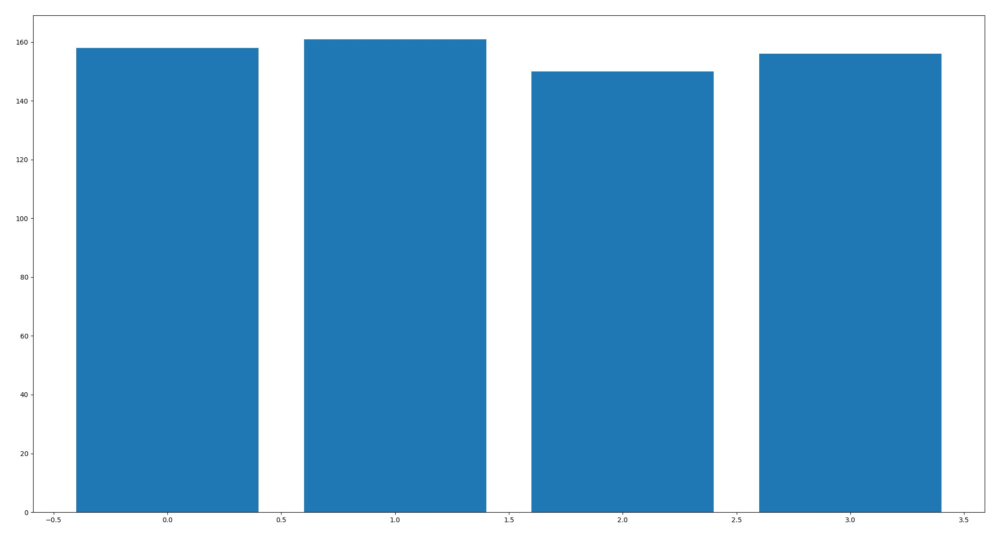
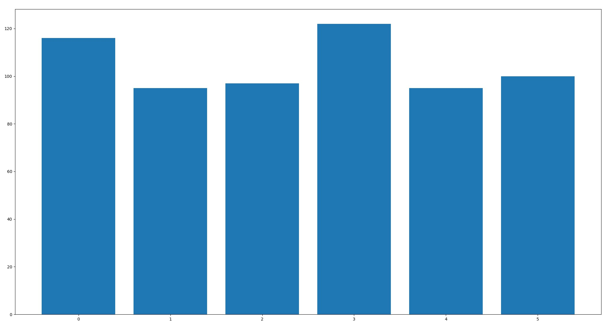
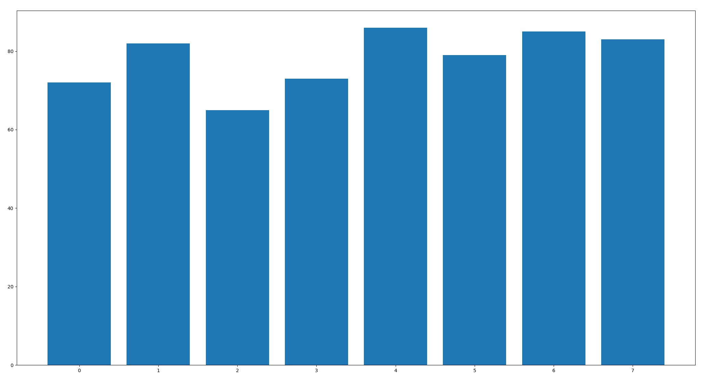

# Preliminary characterization
The message itself is a stream of 8212 bytes. The message has very low entropy, with an overabundance of bits set to zero almost everywhere. The exception is the first 10 and last 10 bytes which are, respectively:

```
00000000  ff ff 06 90 28 41 44 88  44 88 00 00 00 00 00 00  |....(AD.D.......|
00000010  00 00 00 00 00 00 00 00  00 00 00 00 00 00 00 00  |................|
*
```
and:
```
*

00002000  00 00 00 00 00 00 00 00  00 00 f8 3e 00 00 00 00  |...........>....|
00002010  00 00 0f ff                                       |....|
00002014
```

We therefore considered these peripherial bits distinct parts of the message that should be analyzed separately. If we remove them from the message, we are left with a file that is exactly 8192 = 2<sup>13</sup> bytes (or 65536 = 2<sup>16</sup> bits). [A self-correlation analysis](tools/Autocorrelation.ipynb)  on [these central bits](https://discordapp.com/users/monarchofshadow) showed that the signal had a faint (but clear) periodicity:



A detail on the first 1000 displacements showed that this analysis strongly favors a periodicity of period $\tau=256$:



Nonetheless, other interesting repeating structures appear at longer periods:



The full correlation plot makes it tempting to display the bits as an image with 1 bit per pixel, 256 pixels per row. This would result in an image of 65536/256 = 256 bits in height. If we do that, from left to right, top-down, bits 0 in black, bits 1 in white, we arrive to the following picture:

<p align="center"></p>

Note that, while this picture seems to have the same degree of detail in all directions, **we should not discard other orderings of the bits**.

It is also interesting to note that there seems to be no preferred position distribution of ones when bits are grouped that may indicate possible grouping of bits and/or endianness.

Position distribution of ones when bits are grouped in pairs:


Position distribution of ones when bits are in 4 bit groups:


Position distribution of ones when bits are in 6 bit groups:


Position distribution of ones when bits are in 8 bit groups:

